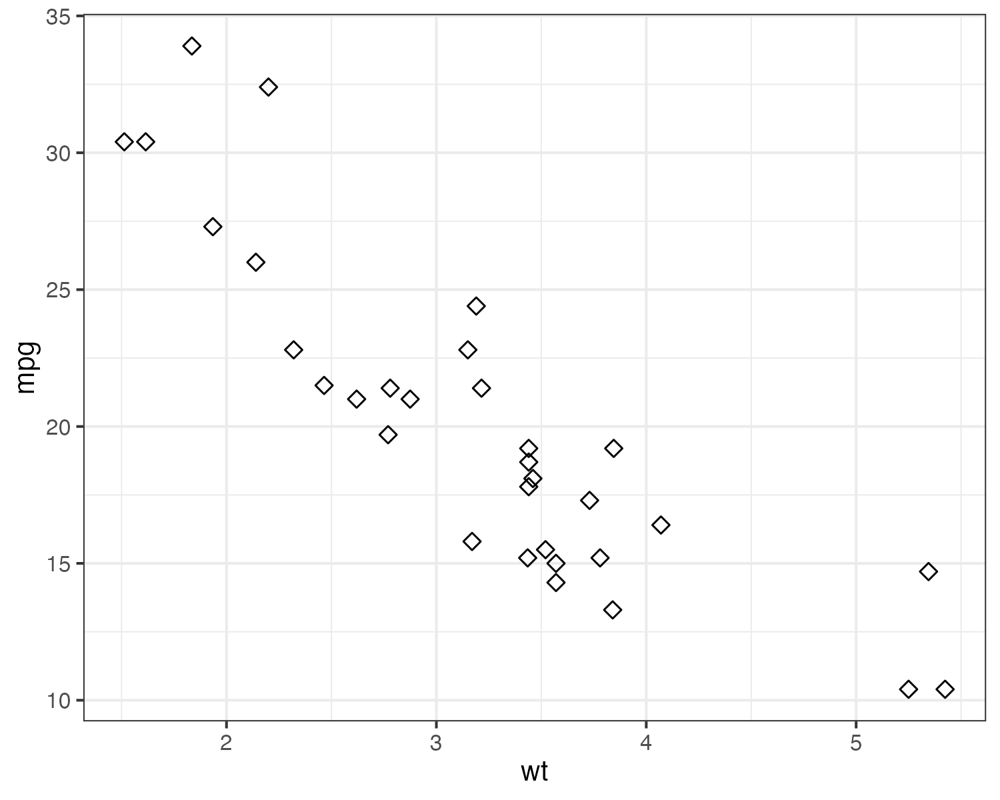
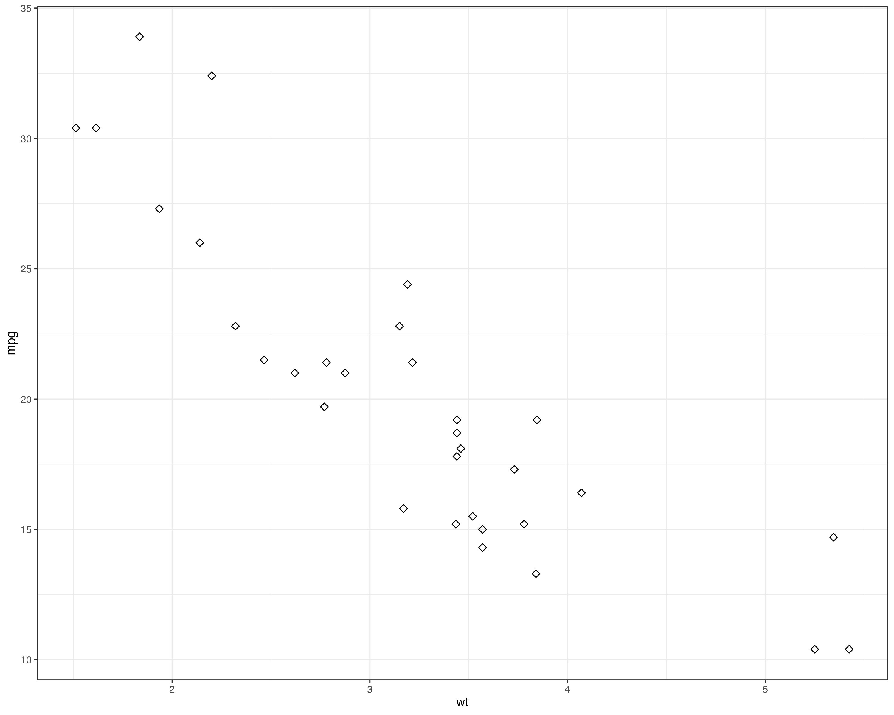

# Tutorial Ggplot part 2

Today, we are going to focus on more advanced plots with Ggplot and how to incorporate some basic statistics into the plots. For more on ggplot, I recommend this book:

Applied data visualization with R and ggplot2 : Create useful, elaborate, and visually appealing plots
Moulik, Tania
2018; Birmingham, UK : Packt Publishing Ltd.

```{r setup, include=FALSE}
knitr::opts_chunk$set(warning = FALSE, message = FALSE, echo = TRUE)
```

We will need the following R libraries:

```{r libraries, message=FALSE}
library(tidyverse)
library(corrplot)
library(cowplot)
library(Ecdat)
library(ggpubr)
library(gridExtra)
library(Lock5Data)
library(mapproj)
library(maps)
```

## Grammar of graphics and visual components

### Themes

```{r block1}
dfn <- subset(HollywoodMovies,
              Genre %in% c("Action", "Adventure", "Comedy", "Drama",
              "Romantic Comedy") &
              LeadStudio %in% c("Lionsgate ", "Paramount Pictures ",
              "Twentieth Century Fox ", "Universal Pictures ", "Warner Bros. "))
p1 <- ggplot(dfn, aes(x=Genre, y=WorldGross)) 
p2 <- p1 + 
  geom_bar(aes(fill=LeadStudio), stat="Identity", position="dodge")
p2
```

```{r block2}
p3 <- p2 + 
  theme(axis.title.x=element_text(size=15),
        axis.title.y=element_text(size=15),
        plot.background=element_rect(fill="gray87"),
        panel.background=element_rect(fill="beige"),
        panel.grid.major=element_line(color="Gray", linetype=1))
p3
```

```{r block3, fig.height = 8, fig.width = 8, fig.align="center"}
p4 <- p2 +
  theme_bw() +
  ggtitle("theme_bw()") +
  theme(axis.text.x=element_text(angle=90))
p5 <- p2 +
  theme_classic() +
  ggtitle("theme_classic()") +
  theme(axis.text.x=element_text(angle=90))
p6 <- p2 +
  theme_gray() +
  ggtitle("theme_gray()") +
  theme(axis.text.x=element_text(angle=90))
p7 <- p2 +
  theme_minimal() +
  ggtitle("theme_minimal()") +
  theme(axis.text.x=element_text(angle=90))
ggarrange(p4, p5, p6, p7, ncol=2, nrow=2, common.legend = TRUE, legend="right")
```

```{r block4}
mytheme <- theme(legend.title=element_blank(),
legend.position="bottom",
text = element_text(color="Blue"),
axis.text=element_text(size=12, color="Red"),
axis.title=element_text(size=rel(1.5)))
```

```{r block5, fig.height = 4, fig.width = 12, fig.align="center"}
p2 <- p2 +
  ggtitle("Original Plot")
p8 <- p2 +
  mytheme +
  ggtitle("Changed Plot with my theme")
grid.arrange(p2, p8, ncol=2)
```

```{r block6}
p4 + scale_fill_brewer(palette="Spectral")
```

```{r block7}
p4 + scale_fill_brewer(palette="Pastel1")
```

```{r block8}
p4 + scale_fill_brewer(palette="Oranges")
```

## More advanced geoms and statistics

### Bubble charts

A bubble chart is a data visualization that displays three dimensions of data using x and y coordinates for two variables and the size of circular "bubbles" to represent a third variable. However, we will see in the lectures that using the size of points (bubbles) in a bubble chart is not an ideal method for making precise comparisons between values. Use it adequately.

```{r block9, message=FALSE, warning=FALSE}
df <- read_csv("../../data/gapminder-data.csv")
dfs <- subset(df, Country %in% c("Germany", "India", "China", "United States", "Japan"))

ggplot(dfs, aes(x=Year, y=Electricity_consumption_per_capita)) +
  geom_point(aes(size=population, color=Country)) +
  coord_cartesian(xlim=c(1950, 2020)) +
  labs(subtitle="Electricity consumption vs Year", title="Bubble chart") +
  ylab("Electricity consumption") +
  scale_size(breaks=c(0, 1e+8, 0.3e+9, 0.5e+9, 1e+9, 1.5e+9), range=c(1, 5))
```

### Density plots

A density plot is a statistical visualization that displays the distribution of a continuous variable by estimating the probability density function of the data. It represents the data using a smooth curve, where the height of the curve at any given point indicates the relative frequency or concentration of data points in that region, providing a more nuanced view of data distribution compared to histograms.

```{r block10, message=FALSE}
df <- read_csv("../../data/LoanStats.csv")
df <- df %>% drop_na(grade)

ggplot(df, aes(x=loan_amnt)) +
  geom_density() +
  facet_wrap(~grade) +
  xlab("Loan amount")
```

We can also superimpose the density plots for easier comparison. Noe that it works better with a small number of values for the categorical variable considered.

```{r block11, message=FALSE }
df <- read_csv("../../data/LoanStats.csv")
df <- df %>% drop_na(grade)

ggplot(df, aes(x=loan_amnt)) +
  geom_density(aes(fill=grade), alpha=1/2) +
  scale_fill_brewer(palette="Dark2") +
  xlab("Loan Amount") +
  theme_light()
```

### Time series

Line plots are ideal for time series data because they effectively illustrate trends, patterns, and changes over time by connecting data points with lines, making it easy to visualize the continuity and progression of values across sequential time intervals.

```{r block12, message=FALSE}
df_fb <- read_csv("../../data/FB.csv")
df_fb$Date <- as.Date(df_fb$Date)

ggplot(df_fb, aes(x=Date, y=Close, group=1)) + 
  geom_line(color="black", na.rm=TRUE) +
  ggtitle("Daily Closing Stock Prices: Facebook") + 
  theme(plot.title = element_text(lineheight=.7, face="bold")) + 
  scale_x_date(date_breaks='3 month') +
  theme_bw()
```

### Statistical summaries

A statistical summary on a visualization plot is a concise representation of key statistical measures or characteristics of the data, such as mean, median, quantile, or standard deviation, often displayed alongside or integrated into the main visual elements to provide additional context and insight into the underlying data distribution.

```{r block13, message=FALSE, warning=FALSE}
df_fb <- read_csv("../../data/FB.csv")
df_fb$Date <- as.Date(df_fb$Date)
df_fb$Month <- strftime(df_fb$Date,"%m")
df_fb$Month <- as.numeric(df_fb$Month)

ggplot(df_fb, aes(Month, Close)) + 
  geom_point(color="red", alpha=1/2, position=position_jitter(h=0.0, w=0.0)) +
  stat_summary(geom="line", 
               fun="mean", 
               color="blue", 
               size=1) +
  stat_summary(geom="line", 
               fun="median", 
               color="orange", 
               size=1) +
  stat_summary(geom="line", 
               fun="quantile", 
               fun.args=list(probs=.1), 
               linetype=2, 
               color="green", 
               size=1) +
  stat_summary(geom="line", 
               fun="quantile", 
               fun.args=list(probs=.9), 
               linetype=2, 
               color="green", 
               size=1) +
  scale_x_continuous(breaks=seq(0, 13, 1)) +
  ggtitle("Monthly Closing Stock Prices: Facebook") +
  theme_classic()
```

### Linear regression

We can also include some statistical modeling into the data visualization. For examples, with a scatter plot we main include the linear regression of the y variable over the x variable to show possible linear relationship.

```{r block14, message=FALSE, warning=FALSE}
df <- read_csv("../../data/gapminder-data.csv")
dfs <- subset(df, Country %in% c("Germany", "India", "China", "United States", "Japan"))

ggplot(dfs, aes(gdp_per_capita, Electricity_consumption_per_capita)) +
  geom_point(aes(color=Country)) +
  xlim(0, 30000) +
  xlab("GDP per capita") +
  ylab("Electricity consumption per capita") +
  geom_smooth(method=lm, level=0.99)
```

If we want to do a linear regression separately for each country, we would proceed like this:

```{r block15, message=FALSE, warning=FALSE}
df <- read_csv("../../data/gapminder-data.csv")
dfs <- subset(df, Country %in% c("Germany", "India", "China", "United States", "Japan"))
ggplot(dfs, aes(gdp_per_capita, Electricity_consumption_per_capita, color=Country)) +
geom_point() +
xlab("GDP per capita") +
ylab("Electricity consumption per capita") +
geom_smooth(method=lm)
```

### Setting the horizontal scale

We used geom_smooth for the linear regression, but it can also be used generally to better see patterns in the presence of overplotting. If we want to limit the size of the window in the x axis, we should note the difference between coord_cartesian and scale_x_continuous. With coord_cartesian, the smoothing is done on all the data, but only the chosen window is plotted. With scale_x-continuous, the smoothing is done only for the chosen window.

```{r block16, message=FALSE, warning=FALSE}
p <- ggplot(mtcars, aes(disp, wt)) +
  geom_point() +
  geom_smooth()
p1 <- p + 
  scale_x_continuous(limits = c(325, 500)) +
  ggtitle("scale_x_continuous")
p2 <- p + 
  coord_cartesian(xlim = c(325, 500)) +
  ggtitle("coord_cartesian")
p <- p + 
  ggtitle("Original plot")
grid.arrange(p, p1, p2, ncol=2)
```

### Correlations

The package corrplot can be used to show a graphical display of a correlation matrix.

```{r block17, message=FALSE}
df <- read_csv("../../data/gapminder-data.csv")
df <- df[, colnames(df)[4:9]]
df <- na.omit(df)
colnames(df) <- c("gdp", "electricity", "mort", "pov", "bmi_m", "bmi_f")
M <- cor(df)
corrplot(M, method="number")
```

```{r block18}
corrplot(M, method="pie")
```

```{r block19}
corrplot(M, method="ellipse")
```

### Maps

GGplot contains basic function such as geom_polyygon and geom_path to make maps. We will see in another tutorial more advanced R packages to represent geospatial data.

```{r block20}
states_map <- map_data("state")

ggplot(states_map, aes(x=long, y=lat, group=group)) +
  geom_polygon(fill="white", colour="black")
```

```{r block21}
ggplot(states_map, aes(x=long, y=lat, group=group)) +    
  geom_path() +
  coord_map("mercator")
```

```{r block22}
europe <- map_data("world",
    region=c("Germany", "Spain", "Italy", "France", "UK", "Ireland"))

ggplot(europe, aes(x=long, y=lat, group=group, fill=region)) +
  geom_polygon(color="black") +
  scale_fill_brewer(palette="Set3")
```

We may also want to add data to the map. A color scale to represent a continuous variable will then be more appropriate. Note than color intensity and color hue are not the best visual cues for a precise comparison between values, but may be used if we only want to show a general spatial pattern.

```{r block23, message=FALSE}
arrests <- as_tibble(USArrests, rownames=NA) %>%
  rownames_to_column("region") %>%
  mutate(region = tolower(region))
states_arrests <- states_map %>% left_join(arrests)

ggplot(states_arrests, aes(x=long, y=lat, group=group)) +
  geom_polygon(aes(fill=Murder), color="black") +
  scale_fill_gradient2(low="cornflowerblue", 
                       high="firebrick1", 
                       midpoint = 10)
```

## Miscellaneous functions

### Setting the figure size in RMarkdown

Define with knitr options at the beginning.

```{r block_24}
df <- read_csv("../../data/gapminder-data.csv")
ggplot(df, aes(gdp_per_capita, Electricity_consumption_per_capita)) +   
  geom_point(aes(color=Country)) +
  xlab("GDP per capita") +
  ylab("Electricity consumption per capita")
```

```{r block_25, fig.height=4, fig.width=8}
ggplot(df, aes(gdp_per_capita, Electricity_consumption_per_capita)) +   
  geom_point(aes(color=Country)) +
  xlab("GDP per capita") +
  ylab("Electricity consumption per capita")
```

```{r block_26, fig.asp=0.3, fig.width=8, out.width="50%"}
ggplot(df, aes(gdp_per_capita, Electricity_consumption_per_capita)) +   
  geom_point(aes(color=Country)) +
  xlab("GDP per capita") +
  ylab("Electricity consumption per capita")
```

### Setting the figure size when saving

```{r block_27}
ggsave(filename = "figures/small_memory_size.png",
  ggplot(mtcars, aes(x=wt, y=mpg)) +
    geom_point(size=2, shape=23) +
    theme_bw(base_size = 10),
  width = 5, height = 4, dpi = 150, units = "in", device='png')
ggsave(filename = "figures/big_memory_size.png",
  ggplot(mtcars, aes(x=wt, y=mpg)) +
    geom_point(size=2, shape=23) + 
    theme_bw(base_size = 10),
  width = 5, height = 4, dpi = 300, units = "in", device='png')
ggsave(filename = "figures/big_figure.png",
  ggplot(mtcars, aes(x=wt, y=mpg)) +
    geom_point(size=2, shape=23) +
    theme_bw(base_size = 10),
  width = 10, height = 8, dpi = 300, units = "in", device='png')
```

You need to scale the figures to get the same size of dots and fonts.

{width=50%}

{width=100%}

### Highlighting parts of the map

We are interested in the gross state product (GSP) of the three states: New York, New Jersey and Connecticut.

```{r block_28}
us_map <- map_data("state")
us_prod <- Produc[Produc$year==1985,]
us_prod$region <- gsub("_", " ", tolower(us_prod$state))
merged_data <- left_join(us_map, us_prod[, c("region", "gsp")], by="region")
choropleth <- ggplot(merged_data) +
  geom_polygon(aes(x=long, y=lat, group=group, fill=gsp), color="black") +
  theme_void() +
  theme(legend.position="bottom") +
  scale_fill_continuous(guide=guide_colorbar(barheight=unit(2, units="mm"),
                                             barwidth=unit(5, units="cm")))
choropleth
```

```{r block_29}
tristate <- c("new york", "new jersey", "connecticut")
long_lim <- merged_data$long[merged_data$region %in% tristate]
lat_lim <- merged_data$lat[merged_data$region %in% tristate]
outer <- merged_data[!merged_data$region %in% tristate,]

choropleth +
  geom_polygon(data=outer, aes(x=long, y=lat, group=group),
               fill="gray", color="black") +
  coord_fixed(xlim=c(min(long_lim), max(long_lim)),
              ylim=c(min(lat_lim),max(lat_lim)),
              ratio=1.3)
```

### Changing the map projection

```{r block_30}
choropleth +
  coord_map() +
  ggtitle("US Map - mercator projection")
```

```{r block_31}
choropleth +
  coord_map(projection = "gilbert") +
  ggtitle("US Map - gilbert projection")
```

```{r block_32}
choropleth +
  coord_map(projection = "conic", lat0 = 50) +
  labs(title = "US Map - conic projection",
       subtitle = "latitute zero = 50")
```

### Contour plots

```{r contour, fig.width=8, fig.height=12}
p <- ggplot(faithfuld, aes(waiting, eruptions, z = density))
p1 <- p + 
  geom_contour()
p2 <- p + 
  geom_contour_filled()
p3 <- p + 
  geom_raster(aes(fill = density)) +
  geom_contour(color="white")
plot_grid(p1, p2, p3, align = "v", nrow = 3, rel_heights = c(1/3, 1/3, 1/3))
```

```
