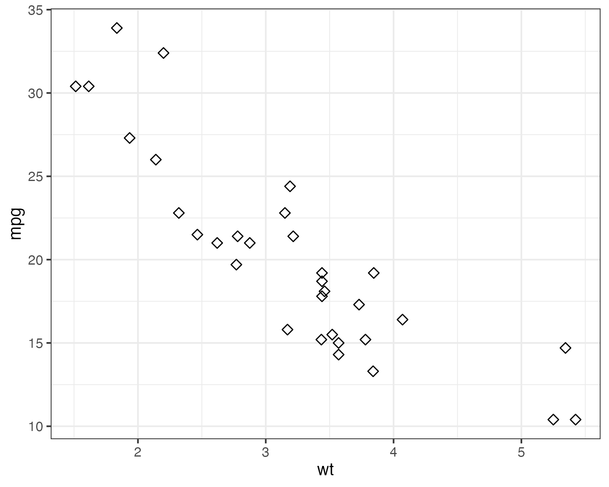
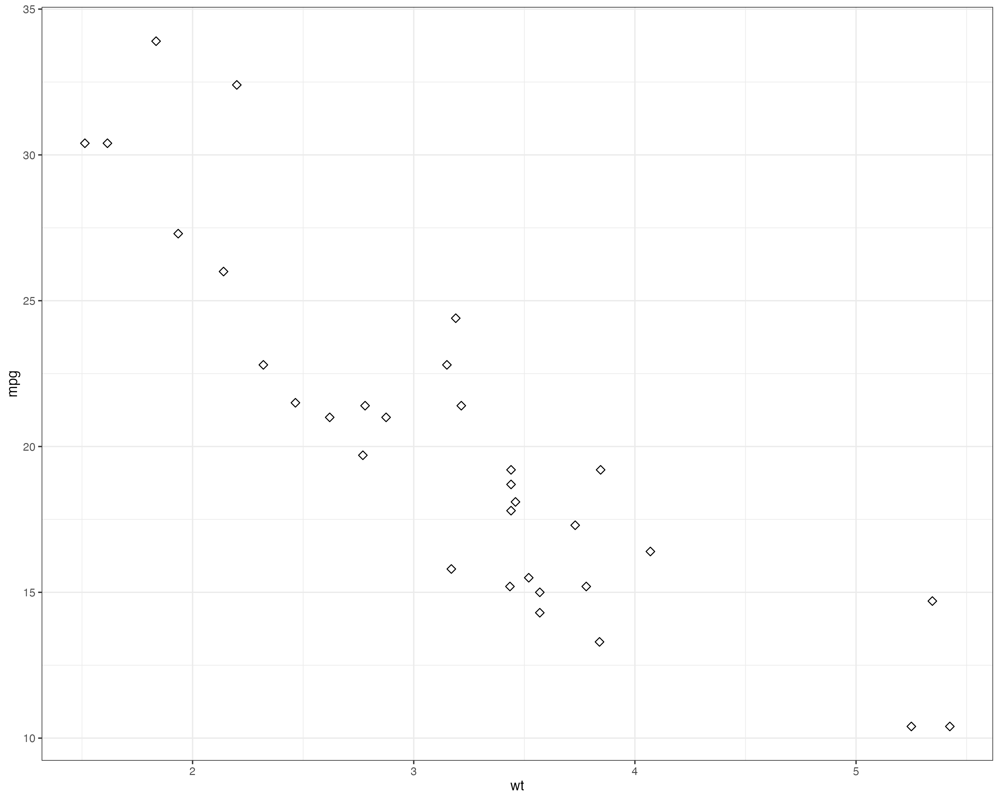

```{r setup, include=FALSE}
knitr::opts_chunk$set(echo = TRUE, fig.width=12, fig.height=8)
```

Load R packages

```{r libraries, message=FALSE}
library(tidyverse)
library(cowplot)
library(Ecdat)
```

# Part 4 - Miscellaneous functions

## Setting the figure size in RMarkdown

Define with knitr options at the beginning.

```{r block_44}
df <- read_csv("../../data/gapminder-data.csv")
ggplot(df, aes(gdp_per_capita, Electricity_consumption_per_capita)) +   
  geom_point(aes(color=Country)) +
  xlab("GDP per capita") +
  ylab("Electricity consumption per capita")
```

```{r block_45, fig.height=4, fig.width=8}
ggplot(df, aes(gdp_per_capita, Electricity_consumption_per_capita)) +   
  geom_point(aes(color=Country)) +
  xlab("GDP per capita") +
  ylab("Electricity consumption per capita")
```

```{r block_46, fig.asp=0.3, fig.width=8, out.width="50%"}
ggplot(df, aes(gdp_per_capita, Electricity_consumption_per_capita)) +   
  geom_point(aes(color=Country)) +
  xlab("GDP per capita") +
  ylab("Electricity consumption per capita")
```

## Setting the figure size when saving

```{r block_47}
ggsave(filename = "figures/small_memory_size.png", ggplot(mtcars, aes(x=wt, y=mpg)) +
  geom_point(size=2, shape=23) + theme_bw(base_size = 10),
  width = 5, height = 4, dpi = 150, units = "in", device='png')
ggsave(filename = "figures/big_memory_size.png", ggplot(mtcars, aes(x=wt, y=mpg)) +
  geom_point(size=2, shape=23) + theme_bw(base_size = 10),
  width = 5, height = 4, dpi = 300, units = "in", device='png')
ggsave(filename = "figures/big_figure.png", ggplot(mtcars, aes(x=wt, y=mpg)) +
  geom_point(size=2, shape=23) + theme_bw(base_size = 10),
  width = 10, height = 8, dpi = 300, units = "in", device='png')
```

You need to scale the figures to get the same size of dots and fonts.

{width=50%}

{width=100%}

## Highlighting parts of the map

We are interested in the gross state product (GSP) of the three states: New York, New Jersey and Connecticut.

```{r block_48}
us_map <- map_data("state")
us_prod <- Produc[Produc$year==1985,]
us_prod$region <- gsub("_", " ", tolower(us_prod$state))
merged_data <- left_join(us_map, us_prod[, c("region", "gsp")], by="region")
choropleth <- ggplot(merged_data) +
  geom_polygon(aes(x=long, y=lat, group=group, fill=gsp), color="black") +
  theme_void() +
  theme(legend.position="bottom") +
  scale_fill_continuous(guide=guide_colorbar(barheight=unit(2, units="mm"),
                                             barwidth=unit(5, units="cm")))
choropleth
```

```{r block_49}
tristate <- c("new york", "new jersey", "connecticut")
long_lim <- merged_data$long[merged_data$region %in% tristate]
lat_lim <- merged_data$lat[merged_data$region %in% tristate]
outer <- merged_data[!merged_data$region %in% tristate,]

choropleth +
  geom_polygon(data=outer, aes(x=long, y=lat, group=group),
               fill="gray", color="black") +
  coord_fixed(xlim=c(min(long_lim), max(long_lim)),
              ylim=c(min(lat_lim),max(lat_lim)),
              ratio=1.3)
```

## Changing the map projection

```{r block_50}
choropleth +
  coord_map() +
  ggtitle("US Map - mercator projection")
```

```{r block_51}
choropleth +
  coord_map(projection = "gilbert") +
  ggtitle("US Map - gilbert projection")
```

```{r block_52}
choropleth +
  coord_map(projection = "conic", lat0 = 50) +
  labs(title = "US Map - conic projection",
       subtitle = "latitute zero = 50")
```

## Contour plots

```{r contour, fig.width=8, fig.height=12}
p <- ggplot(faithfuld, aes(waiting, eruptions, z = density))
p1 <- p + geom_contour()
p2 <- p + geom_contour_filled()
p3 <- p + geom_raster(aes(fill = density)) +
  geom_contour(color="white")
plot_grid(p1, p2, p3, align = "v", nrow = 3, rel_heights = c(1/3, 1/3, 1/3))
```

```
